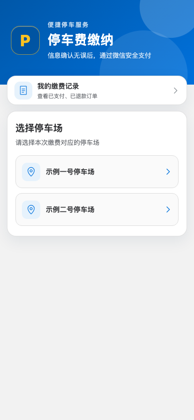
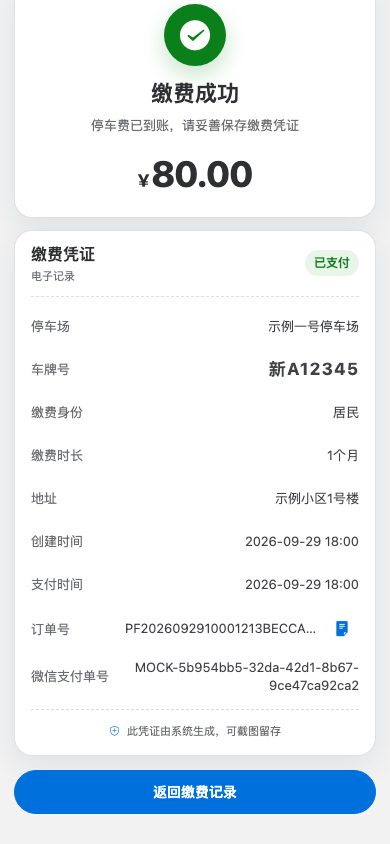
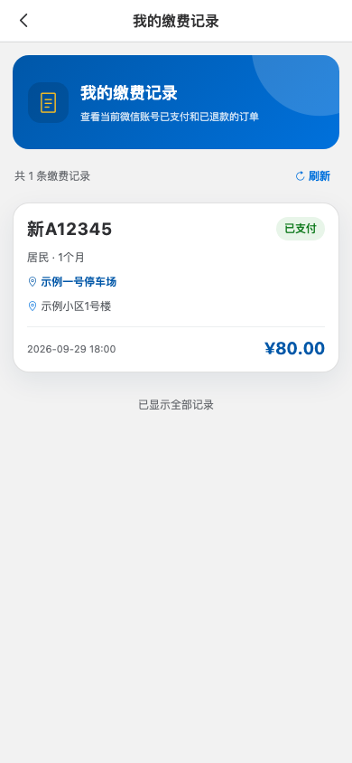
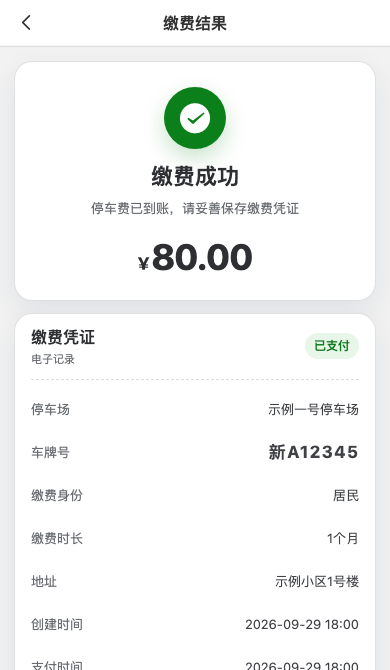
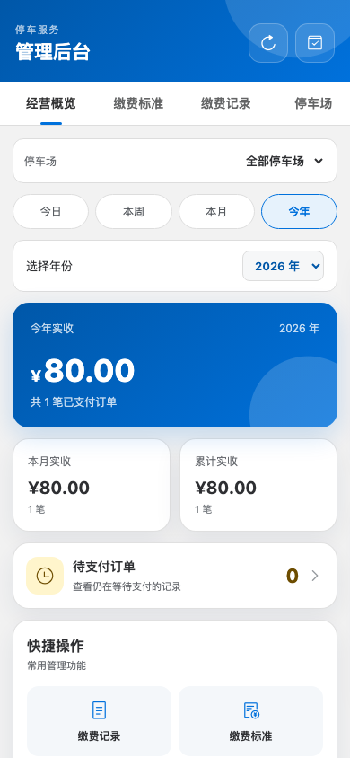
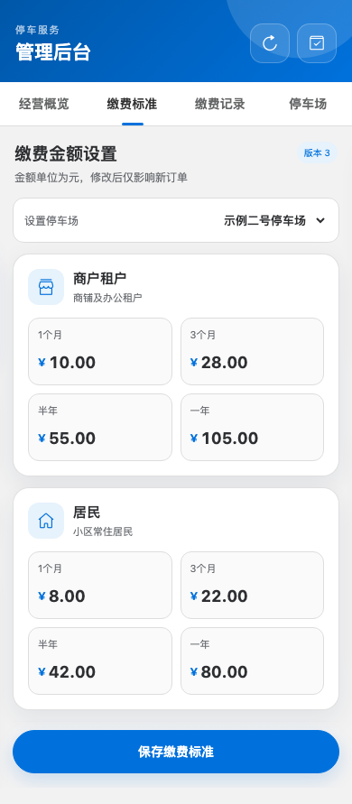
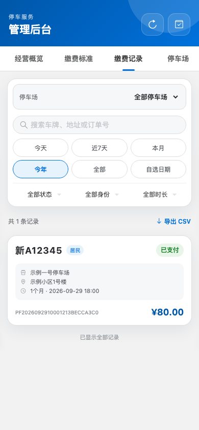
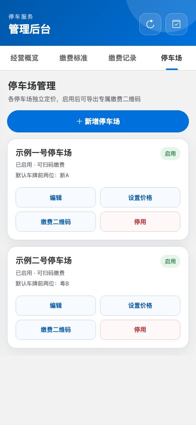
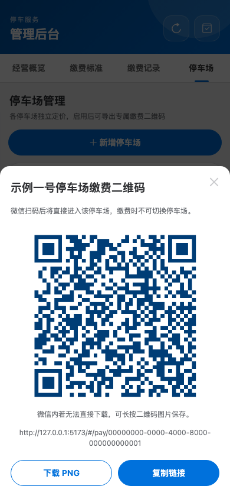

# 停车费缴费应用

一个面向微信内访问的轻量停车费缴费系统。用户扫描停车场专属二维码后填写身份类型、地址、车牌和缴费时长，系统以后端对应停车场的价格为准创建订单并调起微信 JSAPI 支付；用户可查看自己微信账号的缴费记录，管理员可直接用手机管理停车场、维护价格、查看汇总、筛选记录和发起整单全额退款。

普通入口为站点根路径（对应 `/#/pay`）：多个停车场启用时先显示选择页；选择后使用 `/#/pay?parkingLotId=<停车场ID>`，可在缴费页切换停车场。后台生成的专属二维码使用 `/#/pay/<停车场ID>`，扫码后固定停车场，不提供换场入口。两种入口都以服务端校验的停车场与价格下单，不能靠修改页面金额或回跳地址切换订单归属。

## 界面预览

以下截图使用本地模拟支付和虚构停车场、车辆信息，仅用于展示手机端界面。

用户端：

| 选择停车场 | 填写缴费信息 |
| --- | --- |
|  |  |
| 我的缴费记录 | 缴费结果与凭证 |
|  |  |

管理端：

| 管理员登录 | 经营概览 |
| --- | --- |
|  |  |
| 缴费标准 | 缴费记录与筛选 |
|  |  |
| 停车场管理 | 专属缴费二维码 |
|  |  |

## 功能

用户端：

- 专属二维码直达对应停车场的缴费页，页面不提供换场入口；直接访问普通入口时，仅有一个已启用停车场会自动选中，有多个时显示选择页，选场后仍可点击“切换停车场”。选定停车场后，网页标题显示其名称。
- 选择商户租户或居民，填写地址；车牌使用分格键盘输入，前两位按所选停车场预填、车主可修改，并支持普通 7 位与新能源 8 位车牌。
- 选择 1 个月、3 个月、半年或 1 年，实时显示对应价格。
- 微信内网页授权、JSAPI 支付、支付结果与缴费凭证。
- 以当前微信账号查看已支付、已退款记录，跨停车场订单显示下单时的停车场名称；不显示未付款尝试或其他用户订单。
- 后端重新计算金额；订单保存价格快照，后续改价不影响历史订单。
- 下单带价格版本和幂等请求号；价格已变更时要求重新确认，弱网重试不会重复建单。
- 待支付订单与微信预支付统一为 2 小时有效期，超时自动关闭，回调和主动查单均可幂等对账。

管理端：

- 手机端登录；经营概览可查看全部或单个停车场的今日、本周、本月、今年实收，年度视图可切换年份，同时展示本月、累计实收及待支付订单。本周从周一开始，实收按支付时间统计，已退款订单不计入实收。
- 新增、改名、启停停车场，并为每个停车场设置默认车牌前两位（新场默认“新A”）；新场默认停用，设置全部八项非零价格后方可启用。已启用停车场可预览、下载专属二维码 PNG，或复制缴费链接。
- 按停车场分别维护“用户类型 × 缴费时长”价格矩阵。
- 缴费记录默认显示本月，可选今天、近 7 天、今年、全部或自选日期（允许同一天）；可叠加停车场、车牌/地址/订单号关键词、支付状态、用户类型和时长条件。日期按北京时间的订单创建时间筛选。
- 查看订单详情及停车场名称快照；CSV 与列表使用同一组已应用的条件，单次最多导出 20,000 条，超过时需缩小范围。CSV 中的金额单位为分。
- 对已支付且未超过微信退款期限的订单发起整单全额退款，二次确认、同退款单号幂等重试，并展示处理中与最终结果；不支持部分退款，异常结果需人工核查。

## 技术栈与目录

- Node.js 22.12+、TypeScript、Fastify。
- Vue 3、Vue Router、Vant、Vite。
- better-sqlite3；单机部署使用 SQLite WAL，生产事务采用 `synchronous=FULL`，服务启动时自动建表或迁移。
- 生产环境可由 systemd 托管进程，使用 Nginx 或 Caddy 提供 HTTPS 与反向代理，不需要 Docker。

```text
src/server/       后端接口、数据库、微信支付
src/web/          移动端用户页与管理页
tests/            自动化测试
deploy/           systemd、Caddy、安装与备份脚本
data/             本地开发数据库（不提交）
dist/             构建产物（不提交）
secrets/          本地敏感文件（不提交；部署时须主动排除）
```

## 本地开发

要求 Node.js 22.12 或更高版本。首次运行：

```bash
npm ci
cp .env.example .env
npm run dev
```

默认使用 `PAYMENT_MODE=mock`，无需微信商户配置即可完成模拟支付与退款。首次创建的本地数据库会带有初始停车场和仅供开发的示例价格；正式生产数据库首次创建时价格为零，必须先在后台设置实际金额。前端开发地址通常为 `http://127.0.0.1:5173`，Vite 会把 `/api` 代理到 `127.0.0.1:3000`。本地管理员密码在 `.env.example` 中，复制后可自行修改。

`.env.example` 的 `PUBLIC_BASE_URL` 指向后端 `3000` 端口。开发时若要使用后台生成的二维码链接打开 Vite 页面，可把本地 `.env` 中的 `PUBLIC_BASE_URL` 改为 `http://127.0.0.1:5173` 并重启服务；或先执行 `npm run build`，再通过后端 `3000` 端口访问构建页面。`PUBLIC_BASE_URL` 也决定真实微信支付的授权回跳与通知地址，正式环境必须填写公网 HTTPS 根地址。

常用命令：

```bash
npm run dev                 # 同时启动前后端开发服务
npm run typecheck           # TypeScript/Vue 类型检查
npm test                    # 自动化测试
npm run build               # 构建到 dist/
npm start                   # 运行构建结果
npm run admin:hash -- "一个至少10位的高强度密码"
```

## 环境变量

完整模板见 [.env.example](./.env.example)。核心变量如下：

| 变量 | 说明 |
| --- | --- |
| `NODE_ENV` | 生产环境必须为 `production` |
| `HOST` / `PORT` | 生产建议固定为 `127.0.0.1` / `3000` |
| `DB_PATH` | SQLite 文件路径；也支持 `DATABASE_PATH` 别名，但两者不能指向不同文件 |
| `PUBLIC_BASE_URL` | 公网 HTTPS 根地址，如 `https://pay.example.com` |
| `JWT_SECRET` | 登录会话签名密钥，至少 32 字节 |
| `ADMIN_PASSWORD` | 仅本地开发可用的明文密码，生产环境忽略 |
| `ADMIN_PASSWORD_HASH` | `npm run admin:hash` 生成的 bcrypt 哈希，不能填明文 |
| `PAYMENT_MODE` | 本地为 `mock`，正式收费必须为 `wechat` |
| `WECHAT_APP_ID` / `WECHAT_APP_SECRET` | 已认证微信公众号凭据 |
| `WECHAT_MCH_ID` | 微信支付商户号 |
| `WECHAT_MCH_SERIAL_NO` | 商户 API 证书序列号 |
| `WECHAT_MCH_PRIVATE_KEY_PATH` | 商户 API 私钥 PEM 路径 |
| `WECHAT_API_V3_KEY` | 32 字节 API v3 密钥 |
| `WECHATPAY_PUBLIC_KEY_PATH` / `WECHATPAY_PUBLIC_KEY_ID` | 微信支付公钥文件与公钥 ID，用于验签 |
| `WECHAT_NOTIFY_URL` | 支付通知公网 HTTPS 地址；留空时由公网根地址生成 |
| `WECHAT_OAUTH_REDIRECT_URI` | 网页授权回调地址；一般可留空自动生成 |

不要把 `.env`、`secrets/` 中的 PEM 私钥、证书或 API v3 密钥提交到 Git，也不要放入版本目录。敏感文件应放在部署机上独立于发布版本的受限目录；目录权限建议 `0750`，文件权限 `0640`。程序运行需要商户私钥与微信支付公钥及其 ID；`apiclient_cert.pem` 可留存于证书目录，但不是当前 API v3 调用的必填配置。

## 微信公众号与商户平台配置

上线前需准备已认证服务号、微信支付商户号及已备案 HTTPS 域名，并完成服务号 AppID 与商户号绑定。

1. 在公众号后台配置网页授权域名和 JS 接口安全域名，只填写域名，不含协议与路径。
2. 在微信支付商户平台配置 JSAPI 支付授权目录。本项目使用 hash 路由，`https://pay.example.com/#/pay` 对应的授权目录是 `https://pay.example.com/`（`#` 后内容不属于服务端路径）。
3. 将支付通知地址设置为后端实际接口地址，且必须公网 HTTPS 可达。建议使用应用生成的默认地址，或通过 `WECHAT_NOTIFY_URL` 明确指定。
4. 下载商户 API 私钥并填写证书序列号；下载微信支付公钥并填写对应公钥 ID；配置 API v3 密钥。
5. 微信回调必须通过公网域名直接访问，不要加登录认证、IP 白名单或微信无法携带的查询参数。
6. 上线验收后，在管理后台“停车场”页分别下载专属二维码并张贴；二维码仅包含带固定停车场 ID 的 HTTPS 入口，不放入密钥或价格参数。旧的 `/#/pay` 链接仍可使用，但有多个已启用停车场时会先要求选场。

生产订单金额始终由后端价格配置计算。浏览器显示“支付成功”不作为入账依据，系统以验签后的支付通知或主动查单结果为准。

管理员退款会调用微信支付 API v3 并在请求中指定 `https://pay.example.com/api/wechat/refund/notify` 作为退款结果通知地址，不需要在商户平台另设本应用的退款回调。退款申请被受理不代表已经成功，只有验签后的退款通知或主动查单返回成功，订单才变为“已退款”。服务每分钟限量执行只读退款查单，以便在回调丢失时自动确认结果；它不会自动再次提交退款申请。若请求超时或结果不明，必须复用原商户退款单号查询或重试，不能重新生成退款单号；上线验收不要未经授权对真实订单试退。

## 无 Docker 生产部署

部署时将进程交给 systemd 管理，反向代理负责 HTTPS；SQLite 数据库、环境配置和密钥应保存在发布版本之外。仓库包含两套部署材料：`deploy/install.sh` 用于 Ubuntu/Debian + Caddy 自动安装，`deploy/opencloudos9/` 提供 OpenCloudOS 9 + Nginx 的服务与代理配置模板。两者不可混用，应按服务器系统选择。所有域名、路径和端口都以部署环境中的实际配置为准，不在本 README 记录线上实例信息。

### Ubuntu/Debian + Caddy 模板

开放 80/443，应用端口 3000 仅监听本机。提前安装：

- Node.js 22.12+ 与 npm（系统服务不建议使用只对交互 shell 生效的 NVM）。
- Caddy 2。脚本会按需通过 apt 安装 `sqlite3`、`rsync`、`curl`、`gzip`。
- 已解析到服务器且完成 ICP 备案的域名。

部署脚本会创建专用的 `parkfee` 系统用户，将版本放到 `/opt/parkfee/releases/`，原子更新 `/opt/parkfee/current`，把数据放在 `/var/lib/parkfee`，并安装 systemd 服务。运行前须确保源码目录没有 `secrets/` 等敏感文件；当前脚本只排除了 `.env*` 等常见文件，不会自动排除 `secrets/`。第一次可先让脚本生成配置模板：

```bash
sudo PARKFEE_DOMAIN=pay.example.com bash deploy/install.sh
sudoedit /etc/parkfee/parkfee.env
sudo PARKFEE_DOMAIN=pay.example.com bash deploy/install.sh
```

也可提前在仓库外准备好生产配置，一次部署：

```bash
sudo PARKFEE_DOMAIN=pay.example.com \
  PARKFEE_ENV_FILE=/root/parkfee-production.env \
  bash deploy/install.sh
```

脚本默认执行测试和构建。紧急部署可设置 `RUN_TESTS=0`，但正常发布不建议跳过。再次运行同一命令即可升级，脚本会先创建 SQLite 一致性备份，再原子切换代码，并默认保留最近 3 个版本。Caddy 站点保存到 `/etc/caddy/sites/parkfee.caddy`，主配置只追加一条 `import`，不会覆盖服务器上其他站点。如果未传 `PARKFEE_DOMAIN`，脚本只部署本机应用，不配置公网入口。

部署后检查：

```bash
systemctl status parkfee caddy
systemctl status parkfee-backup.timer
journalctl -u parkfee -f
curl --fail http://127.0.0.1:3000/api/health
curl --fail https://pay.example.com/api/health
```

应用服务使用 `ProtectSystem=strict` 等 systemd 沙箱选项，只能写 `/var/lib/parkfee` 和 `/var/log/parkfee`。如自行修改数据目录，必须同步修改 [deploy/parkfee.service](./deploy/parkfee.service) 的 `ReadWritePaths`。

### OpenCloudOS 9 + Nginx 模板

`deploy/opencloudos9/` 提供 systemd、Nginx、定时备份与证书续期单元。此方案由运维人员自行准备运行目录和受限配置，在服务器的 Linux 环境执行 `npm ci`、`npm run build`、`npm prune --omit=dev` 后发布；不要把本地 `node_modules`、`.env`、`secrets/` 或开发数据库上传到版本目录。发布前先做 SQLite 一致性备份，随后原子切换 `current` 指向新版本并重启服务；健康检查、业务抽查通过后才算完成上线。

## 数据备份与恢复

`deploy/backup.sh` 使用 SQLite `.backup` 在线生成一致性副本，执行完整性检查，再 gzip 压缩并生成 SHA-256 校验文件，默认保留 30 天。Ubuntu/Debian 安装脚本会将它安装为 `/usr/local/sbin/parkfee-backup` 并启用每日定时器；OpenCloudOS 模板通过 `parkfee-backup.service` 和对应定时器调用同一脚本。检查备份定时器：

```bash
systemctl list-timers parkfee-backup.timer
```

脚本支持 `ENV_FILE`、`DB_PATH`、`BACKUP_DIR`、`RETENTION_DAYS`，以及可选的 `OSS_DEST`（需预先安全配置 `ossutil`）。备份应另存到独立存储，并定期校验 SHA-256、解压后运行 `PRAGMA quick_check`，使用隔离测试实例演练恢复。真正恢复前应停服务并完整保留当前数据库及 WAL/SHM 文件；不得仅复制主数据库文件，更不能以旧备份覆盖恢复点之后的新交易。

## 上线检查清单

- [ ] 域名、备案、DNS 与 80/443 网络连通性符合部署要求；反向代理 HTTPS 证书有效且能自动续期。
- [ ] 应用仅监听本机地址，应用端口不对公网开放；systemd 服务及备份定时器正常。
- [ ] `NODE_ENV=production`、`PAYMENT_MODE=wechat`，随机密钥与管理员哈希已替换。
- [ ] 微信公众号网页授权域名、JS 接口安全域名配置正确。
- [ ] JSAPI 支付授权目录覆盖实际缴费页路径。
- [ ] `notify_url` 是公网 HTTPS 地址，微信可直接访问，回调验签与幂等处理通过。
- [ ] 每个要启用的停车场都填完 8 项正式价格；普通入口可选场，专属二维码只能进入对应停车场。
- [ ] 用低金额订单在微信真机完成支付、取消、重复回调、主动查单和凭证查看。
- [ ] 价格修改后旧订单金额不变；按停车场与日期筛选的列表、汇总和 CSV 导出正确。
- [ ] 当前微信账号可查看自己的已支付/已退款记录，其他账号不能查看。
- [ ] 全额退款仅管理员可操作；退款通知和主动查单均可确认状态，重复点击或重复回调不会重复退款。
- [ ] 已执行备份恢复演练，备份不只保存在同一块系统盘；异地存储为私有权限。
- [ ] 已配置磁盘空间、服务存活、HTTPS 证书、备份失败和支付异常监控告警。
- [ ] 已检查应用与反向代理日志中不输出密钥、完整 OpenID 等敏感信息。

## 日常运维

```bash
systemctl restart parkfee
journalctl -u parkfee --since today
systemctl show parkfee -p ActiveState -p SubState -p NRestarts
```

反向代理的重载命令取决于所选的 Nginx 或 Caddy 方案。升级前必须备份并核对数据库；启用第二个停车场且产生独立价格后，不能盲目回退到多停车场改造前的旧程序继续收款，也不能用旧数据库备份覆盖新交易。故障时先暂停新订单，再前向修复或执行经过核对的兼容回退方案。
